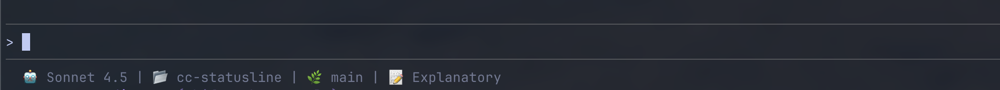

# Claude Code Simple Statusline

A simple, clean statusline for Claude Code that displays essential context: model, directory, git branch, and output style.


## Features

- 🤖 **Model Display**: Shows current Claude model (e.g., Sonnet 4.5)
- 📂 **Current Directory**: Displays the basename of your working directory
- 🌿 **Git Integration**: Shows current git branch when in a git repository
- 📝 **Output Style**: Displays your active Claude Code output style (configurable via `/output-style` command)
  - Examples: Educational, Concise, Professional, etc.

## Quick Start

### One-Command Install

**Latest stable version (recommended):**
```bash
bash <(curl -fsSL https://raw.githubusercontent.com/bishnubista/cc-statusline/main/install.sh)
```

**Specific version:**
```bash
VERSION=v1.0.0 bash <(curl -fsSL https://raw.githubusercontent.com/bishnubista/cc-statusline/main/install.sh)
```

Then restart Claude Code!

### Manual Install

<details>
<summary>Click to expand manual installation steps</summary>

```bash
# Download the statusline script
curl -fsSL https://raw.githubusercontent.com/bishnubista/cc-statusline/main/statusline.sh -o ~/.claude/statusline.sh
chmod +x ~/.claude/statusline.sh

# Configure Claude Code (create or update ~/.claude/settings.json)
cat > ~/.claude/settings.json << 'EOF'
{
  "statusLine": {
    "type": "command",
    "command": "~/.claude/statusline.sh",
    "padding": 0
  }
}
EOF

# Restart Claude Code
```

</details>

## What You'll See

**Example in action:**



**In a git repository:**
```
🤖 Sonnet 4.5 | 📂 cc-statusline | 🌿 main | 📝 Explanatory
```

**Outside a git repository:**
```
🤖 Sonnet 4.5 | 📂 my-project | 📝 Concise
```

## Why This Statusline?

This statusline focuses on **context awareness** rather than metrics:

- **Model**: Know which Claude model you're using for the current conversation
- **Directory**: Quick reference to confirm you're in the right project
- **Git Branch**: Avoid making changes on the wrong branch
- **Output Style**: See which communication style Claude Code is using (helpful when switching between styles)
  - *Note: Output style is a Claude Code feature that can be configured using the `/output-style` command*

## Files

- `statusline.sh` - Main statusline script
- `INSTALLATION.md` - Detailed installation and troubleshooting guide
- `settings.json` - Example Claude Code configuration

## Requirements

- **Claude Code 2.0+**
- **jq** (JSON processor) - Install before running the installer:
  ```bash
  # macOS
  brew install jq

  # Ubuntu/Debian
  sudo apt-get install jq
  ```
- **curl** or **wget** (for installation only, usually pre-installed)
- **bash** (pre-installed on macOS/Linux)
- **Git** (optional, for branch display)

## Uninstall

**One-Command Uninstall:**
```bash
bash <(curl -fsSL https://raw.githubusercontent.com/bishnubista/cc-statusline/main/uninstall.sh)
```

**Manual Uninstall:**
```bash
rm ~/.claude/statusline.sh
# Then manually remove the statusLine section from ~/.claude/settings.json
```

## Configuring Output Style

The **Output Style** displayed in the statusline is a Claude Code feature that controls how Claude communicates with you. You can change it using:

```bash
/output-style
```

This will let you choose from different communication styles like:
- **Educational**: Detailed explanations with context and learning insights
- **Concise**: Brief, to-the-point responses
- **Professional**: Formal business communication
- And more...

The statusline will automatically update to show your active output style!

## Customization

The statusline is intentionally minimal, but you can customize it by editing `statusline.sh`:

### Change Display Icons

```bash
dir_display="📂 $dir_name"    # Change 📂 to any emoji
git_info="🌿 $branch"         # Change 🌿 to any emoji
# etc.
```

### Add Additional Fields

The `$input` JSON contains other data you can extract:
```bash
# Example: Add timestamp
timestamp=$(date +%H:%M)
echo "🤖 $model | 🕐 $timestamp | $dir_display | ..."
```

## Version History

Current version: **v1.0.0**

See [CHANGELOG.md](CHANGELOG.md) for detailed release history and changes.

## Troubleshooting

See [INSTALLATION.md](INSTALLATION.md#troubleshooting) for detailed troubleshooting steps.

Common issues:
- **Statusline not appearing**: Check `~/.claude/settings.json` syntax
- **"jq: command not found"**: Install jq via your package manager
- **Git branch not showing**: Make sure you're in a git repository

## How It Works

1. Claude Code calls `statusline.sh` and passes JSON data via stdin
2. Script extracts model name, current directory, and output style from the JSON
3. Checks if the current directory is a git repository
4. If in a git repo, extracts the current branch name
5. Returns formatted statusline string to Claude Code

## License

MIT License - Feel free to modify and distribute

## Contributing

Issues and pull requests welcome! This is a personal tracking tool, so feel free to fork and customize for your needs.

## Acknowledgments

Built for the Claude Code community. Not affiliated with Anthropic.
